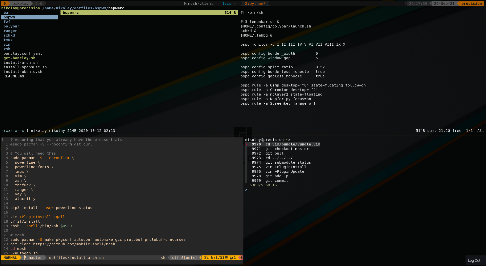

# mikolasan's dotfiles



## How to

Get your new system ready

**Ubuntu**
```
sudo apt-get install --assume-yes git curl
```

**openSUSE**
```
sudo zypper install --no-confirm git curl
```

**Arch**
```
sudo pacman -S --noconfirm git curl
```

Clone the repository and init submodules

```
git clone https://github.com/mikolasan/dotfiles.git ~/dotfiles
cd ~/dotfiles
git submodule update --init
```

I'm using [Bonclay](https://github.com/talal/bonclay) to restore/backup dotfiles.
The simplest way to install Bonclay on Linux is to run

```
sudo ~/dotfiles/get-bonclay.sh
```

Then create symlinks

```
bonclay sync bonclay.conf.yaml
```

And follow commands from `install-<DISTRO>.sh` or run them all at once

## TODO

- Prepare similar install script for arch/manjaro
